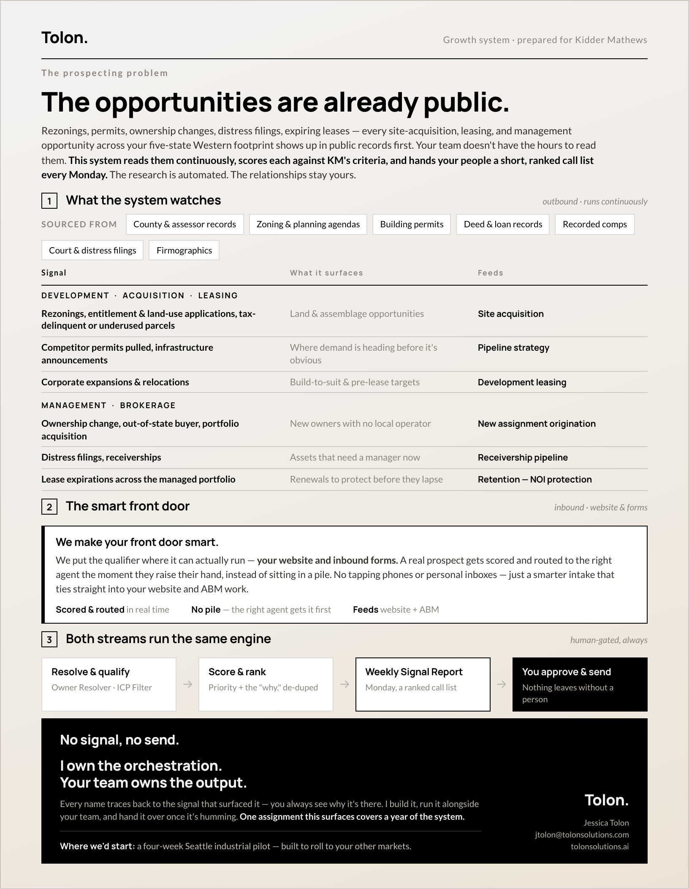
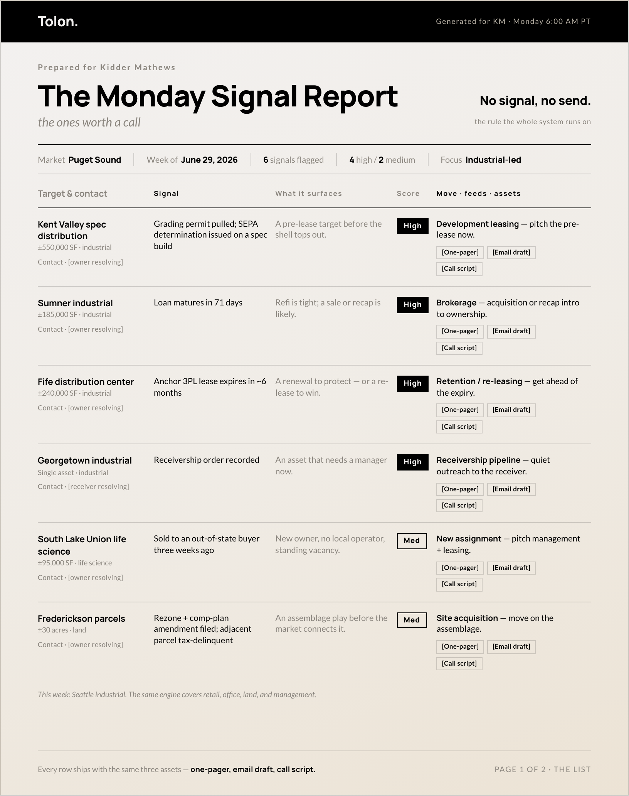
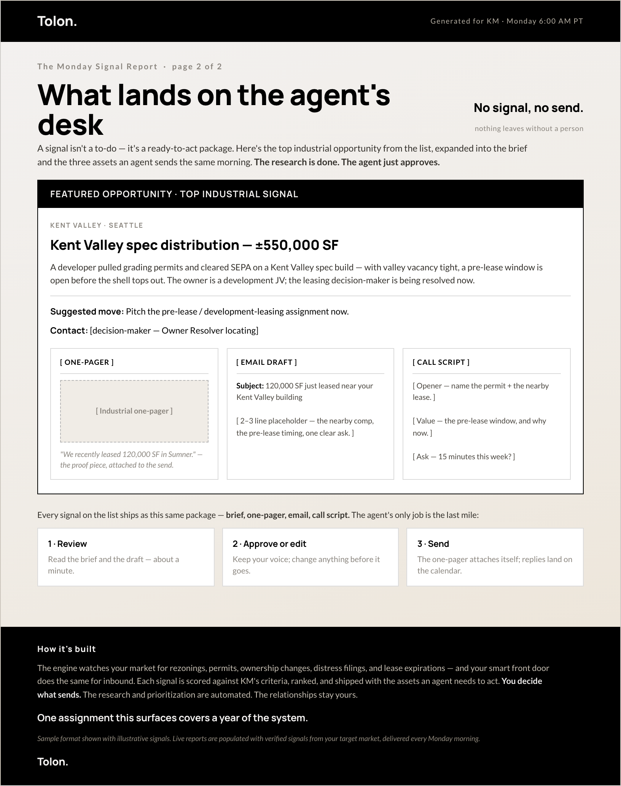

# Example — Kidder Mathews

A live-call build of the CRE Prospecting System, tailored from the prospect's
website with no property preference supplied — the focus was inferred.

- **Prospect:** Kidder Mathews (KM), the largest independent commercial real estate
  firm on the West Coast — brokerage, property management, valuation ([kidder.com](https://kidder.com)).
- **Market:** Puget Sound (Seattle).
- **Focus:** industrial-led pilot (4 industrial signals + 2 minority rows across
  life science and land/development), using Puget Sound submarkets and Washington
  regulatory vocabulary (SEPA, comp-plan amendment).
- **Framing:** a four-week Seattle industrial pilot, built to roll to other markets.

## Files

| File | What it is |
| --- | --- |
| `01-growth-system.pdf` / `.html` | The Growth System one-pager (1 page) |
| `02-signal-report.pdf` / `.html` | The Monday Signal Report sample (2 pages) |
| `previews/` | PNG previews of each page |

## Previews

**Growth System**

**Monday Signal Report — page 1 (the list)**

**Monday Signal Report — page 2 (what lands on the agent's desk)**

## Notes

- Signals, contacts, and the three action assets are **illustrative placeholders**
  (`[owner resolving]`, `[One-pager]`, `[Email draft]`, `[Call script]`). Live
  reports would be populated with verified signals and resolved decision-makers.
- Regenerate the PDFs after editing the HTML: `node ../../build.mjs .`
